# adaptive_algorithmic_trading_bot

Creating and optimizing an algorithmic trading bot with machine learning that predicts signals for an emerging market stock index.

---

## Technologies

This project leverages python 3.7 with the following packages:

* [pandas] (https://github.com/pandas-dev/pandas) - For data manipulation and analysis.

* [pathlib] (https://github.com/budlight/pathlib) - For importing cvs files using standarized file path notation.

* [hvplot] (https://github.com/holoviz/hvplot) - For data visualization.

* [sklearn] (https://github.com/scikit-learn/scikit-learn) - For machine learning built on top of SciPy.

* [matplotlib] (https://github.com/matplotlib/matplotlib) - For interactive data visualizations.

* [numpy] (https://github.com/numpy/numpy) - For scientific computing.

---

## Dataset

Dataset pulled from Resources folder which contains csv file of an emerging market stock index time series in OHLCV format.

## Usage

This is designed to be run in jupyter lab. Upon launching machine_learning_trading_bot.ipynb run each cell sequentially, ensuring to import the required libraries and install the required dependencies.

### Evaluation Report

### Establishing Baseline with SVM

After adding a four-day short and a one-hundred-day long SMA, and training the model using three months of data this model predicts signals for longing and shorting the stock index using SVM machine learning model.

Then we applied the predicted signals to the test data. The graph below shows the resulting cumulative returns of the trading strategy compared to the actual returns, if one were to simply buy and hold the index.

As you can see, applying the predicted signals resulted in increased cumulative returns comparitive to the actual returns. 

### Tuning the Baseline Trading Algorithm

In order to optimize our algorithm we experimented with adjusting the input parameters to find the combination that results in the best trading outcomes.

#### Adjusting Size of Training Dataset

The training data was sliced into different periods ranging from 1 month -36 months. Shown below are the results of each training period.

One month training period.
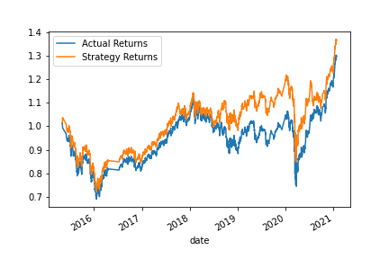

Six month training period.

Nine month training period.
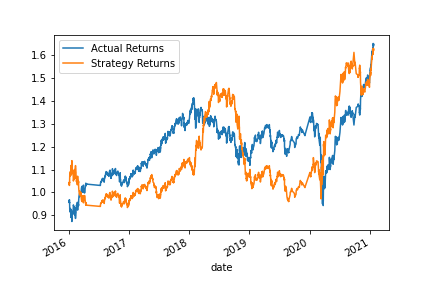

Twenty-four month training period.
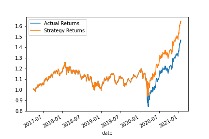

Thirty-Six month training period.
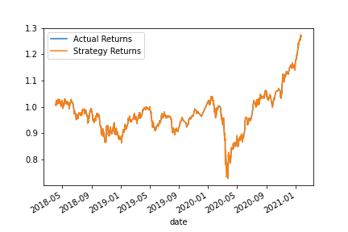

When the training period was decreased we saw reduced returns. When the training period was increased we saw increased returns up untill a six month training period. Increasing the training period more than six months resulted in reduced returns. Therefore the six month training period produced the largest cumulative returns for the model.

#### Adjusting SMA Input Features

The short and long SMA features were then adjusted to determine the best combination. Show below are the results

Two day short SMA, One-hundred day long SMA
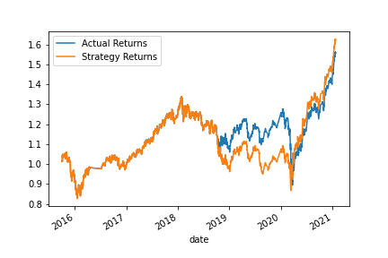
Two day short SMA, Fiftey day long SMA
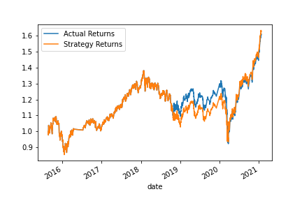
Four day short SMA, One-hundred-fiftey day long SMA
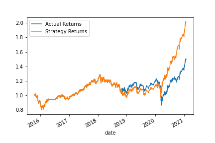
Four day short SMA, Two-hundred day long SMA
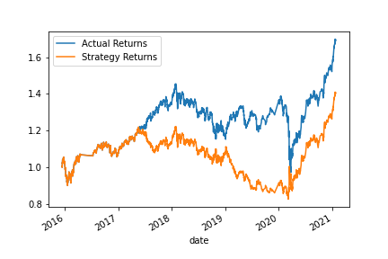
Eight day short SMA, One-hundred day long SMA
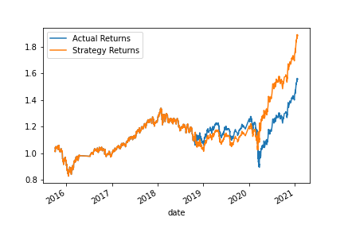
Eight day short SMA, One-hundred-fiftey day long SMA
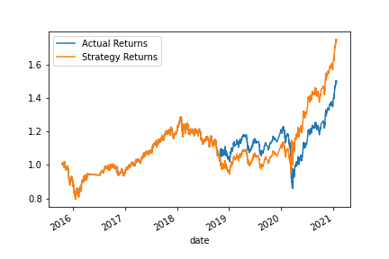
Fiftey day short SMA, Two-hundred day long SMA

When we decreased the short SMA we saw a reduction in returns. When we decreased the short SMA and long SMA together we also saw a reduction in returns. When we increased the long SMA and kept the short SMA the same we saw an increase in returns. When we increased long SMA more than 150 we saw diminishing returns. When we increased the short SMA and kept the long SMA the saw we saw a reduction in returns. When we increased the short SMA and long SMA we saw a reduction in returns. When we increased the short SMA and long SMA dramtically we saw a reduction in reuturns

Based on this experiementation combining the Four-day short SMA and One-hundred-fiftey day long SMA resulted in the highest cumulative returns for the model.

#### Optimal Combination of Parameters

The optimal combination of parameters was a six month training period combined with a Four-day short SMA and One-hundred-fiftey day long SMA. 

Optimal Strategy:

### Evaluating a New Machine Learning Classifier

This uses the original parameters and applies the AdaBoost classifier to determine if it will result in more favorable trading outcomes. Here is a comparison between the SVM and AdaBoost models.

SVM                        |  AdaBoost
:-------------------------:|:-------------------------:
   |  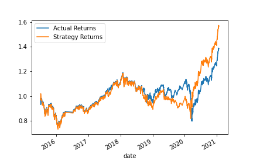

Although this model produced the same accuracy score it resulted in larger cumulative gains for the model. Therefore the AdaBoost classifier seems to be slightly more optimal for this trading algorithim

## Conclusion

The highest cumulative returns came from increasing the training period to 6 months, and ajusting the feature inputs to a four-day short SMA and One-hundred-fiftey day long SMA using the SVM machine learning classifier. Futher research is needed to determine what the optimal parameters are for the AdaBoost classifier. When comparing the baseline AdaBoost to the baseline SVM it does perform better so this suggests that it may be a superior machine learning classifier for this problem.